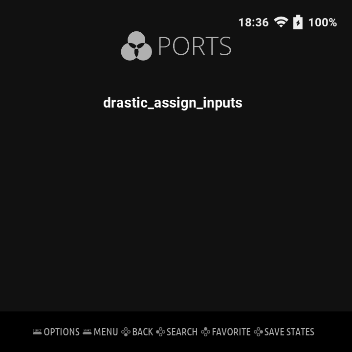
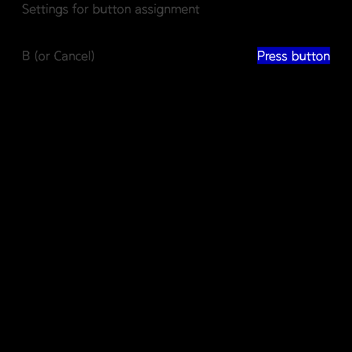

### advanced_drastic

This project was launched to overcome the limitations of screen output and input fixed as base with the drastic-steward 32-bit source developed for miyoomini by steward-fu.

### TOC
1. [history](#history)
2. [custom cheat](#custom-cheat)
3. [download location](#download-location)
4. [Installation Guide](#Installation-Guide)
4. [trouble shootings](#trouble-shootings)

### checksum
For normal operation, you must use the drastic file below. 
md5sum:59a7711eff41c640b8861b4d869c747d  drastic_v2520 
md5sum:a08e38854fe32d86b60167a1c43d9175  drastic_v2520 
md5sum:17550db727f3b59d36b57746ad1944be  drastic_v2522 

### history

- The parts that differ from drastic-steward are as follows.

1. Hooked based on 64 bit drastic.
2. You can still use the drastic default input settings menu (keyboard/mouse/vibration support)
3. Configure the settings screen and layout screen based on the detected resolution.
4. You can configure a separate layout.json file to change the background image to define it.
5. Supports writing .sav files.

Other changings are as follows. 
[history](history.md)

### download location
The information below is old information. It will be updated further.

You can download the library from the following path. 
[libs](https://github.com/trngaje/advanced_drastic/tree/master/libs)  
Copy to `libadvdrastic.so` to `libs` folder  

Supports all devices with gpu.

The function for hooking drastic is defined on libadvdrastic.so.

- The devices that have been verified for operation are as follows. 

folder | platform | glibc version
-------| -------------| -----
knulli_muos_h700 | h700 devices(rg35xx-h/p/sp, rg34xx, rg40xx-h/v, rgcubexx, rg35xx for knull / muos) | 2.40
knulli_muos_a133p | a133 device(trimui smart pro / s, trimui brick for knulli ) with internal rumble | 2.40
tsp | a133 devices (trimui smart pro / s, trimui brick for crossmix os) with internal rumble | 2.33
rocknix | rk3566, rk3326, ogu devices (rg arc-s,rgb30,rgds .. for rocknix) | 2.40
dArkos | | 2.41
miyooflip | supports internal rumble | 2.36

Checked normal operation in various os. (knulli / muos / rocknix / crossmix or spruceos)

### Installation Guide

#### general script
common basic script to run drastic : launch.sh  
need to use LD_PRELOAD instead of libSDL2* to hook drastic functions
~~~
#!/bin/sh

mydir=`dirname "$0"`

export LD_LIBRARY_PATH=$mydir/libs:$LD_LIBRARY_PATH

cd $mydir

CURRENT_DIR=`pwd`

unset LD_PRELOAD
export LD_PRELOAD=$CURRENT_DIR/libs/libadvdrastic.so

./drastic "$1"
~~~

#### for muos
in muos  
/opt/muos/share/emulator/drastic-trngaje/libs/rg/
/opt/muos/share/emulator/drastic-trngaje/libs/tui/

need `libadvdrastic.so` only, remove `libSDL2-2.0.so.0` file
[/opt/muos/share/emulator/drastic-trngaje/libs/rg]# ls
libSDL2-2.0.so.0.org  libadvdrastic.so      libjson-c.so.5

launch.sh in muos
~~~
#!/bin/sh

. /opt/muos/script/var/func.sh

DRASTIC_DIR=$(dirname "$0")
DRASTIC_LIB="$DRASTIC_DIR/libs"

case "$(GET_VAR "device" "board/name")" in
        rg*) DRASTIC_LIB="${DRASTIC_LIB}/rg" ;;
        tui*) DRASTIC_LIB="${DRASTIC_LIB}/tui" ;;
esac

export LD_LIBRARY_PATH=$DRASTIC_LIB:$LD_LIBRARY_PATH

cd "$DRASTIC_DIR" || exit 1

LD_PRELOAD=${DRASTIC_LIB}/libadvdrastic.so  ./drastic_v2522 "$1"

U_DATA="/userdata"
[ -d "$U_DATA" ] && rm -rf "$U_DATA"
~~~

#### for spruce os

spruce os : tsp / trmui brick, tsps

The location of the library is as below. Replace with the distribution library.
`/mnt/SDCARD/Emu/NDS/lib64_A133P_trngaje/libadvdrastic.so`

The script for running is as follows.
`/mnt/SDCARD/spruce/scripts/emu/lib/drastic_functions.sh`

~~~
LD_PRELOAD=$EMU_DIR/libs/libadvdrastic.so  $EMU_DIR/drastic "$*" > /dev/pts/0 2>&1

run_drastic_trngaje_a133p() {
        ready_arch_64_states
        export LD_LIBRARY_PATH="$HOME/lib64_A133P_trngaje:$LD_LIBRARY_PATH:$HOME/lib64"
        [ ! -e ./drastic ] && cp ./drastic64 ./drastic
        LD_PRELOAD=$HOME/lib64_A133P_trngaje/libadvdrastic.so ./drastic "$ROM_FILE" > ${LOG_DIR}/${CORE}-${PLATFORM}.log 2>&1
        stash_arch_64_states
}
~~~

#### for crossmix
The information below is old information. It will be updated further.

test files for crossmix, trimui smart pro  
- step1.back up /mnt/SDCARD/Emus/NDS folder
- step2.download a below file
~~[https://github.com/trngaje/tsp_binary/releases/download/test/NDS.tar.gz](https://github.com/trngaje/tsp_binary/releases/download/test/NDS.tar.gz)~~
- step3.unzip the file in device

#### for knulli
Description based on the official version(gladiator-ii-20250813).  
##### To modify temporarily  
- step1. Run "nds rom" once to create "/userdata/system/configs/advanced_drastic/".  
- step2. Remove libSDL2-2.0.so.0 in /userdata/system/configs/advanced_drastic/libs.  
- step3. Copy libadvdrastic.so to /userdata/system/configs/advanced_drastic/libs/  
- step4. replace launch.sh with general script (launch.sh)  

The key placement defined in the official version is different from what I have guided. Modify it as necessary.  

##### To modify permanently  
- step1. remove the folder()/userdata/system/configs/advanced_drastic/).
- step2. modify all in /usr/share/advanced_drastic/

##### Additional Information
ssh : root/linux  
hostname :KNULLI

#### for rocknix
Identified Devices : rg ds 

Run script to install from the officially released os.

#### for stockos (miyoo flip)

#### for stockos (trimui smart pro s)

1. unzip advanced_drastic.tar.gz in /mnt/sdcard/mmcblk1p1/Emus/NDS/
2. edit scripts

edit config.json
~~~
{
    "label":"NDS",
    "icontop":"../_theme/ic-nds.png",
    "icon":"",
    "background":"../_theme/bg-nds.png",
    "launch":"launch_advdrastic.sh",
    "themecolor":"FF8800",
    "iconsel":"",
    "rompath":"../../Roms/NDS",
    "imgpath":"../../Imgs/NDS",
    "useswap":0,
    "shortname":0,
    "hidebios":0,
    "launchlist": [
        {
            "name": "Drastic",
            "launch": "launch_advdrastic.sh"
        }
    ]
}
~~~

create launch_advdrastic.sh
~~~
#!/bin/sh
echo $0 $*

progdir=`dirname "$0"`/advanced_drastic

cd $progdir
export LD_LIBRARY_PATH=$LD_LIBRARY_PATH:$progdir/libs

../cpufreq.sh
../cpuswitch.sh

echo 1 > /sys/class/drm/card0-DSI-1/rotate
echo 1 > /sys/class/drm/card0-DSI-1/force_rotate

CURRENT_DIR=`pwd`

unset LD_PRELOAD
export LD_PRELOAD=$CURRENT_DIR/libs/libadvdrastic.so

export HOME=/mnt/SDCARD
./drastic_v2522 "$1"
~~~

3. libadvdrastic.so can be overwritten in the path below.
/mnt/sdcard/mmcblk1p1/Emus/NDS/advanced_drastic/libs/

#### for dArkos

Identified Devices : rgb30 

##### to install advdrastic
step1. Copy "install_for_darkos_rocknix.sh" to the "/roms/ports/" folder and run it. 
- After execution, a "drastic.tar.gz" backup file is created in the "/opt/" folder and can be restored to the previous state at any time. 

step2. Copy "drastic_assign_inputs.sh" to the ""/roms/ports" folder and run it. Enter the key according to the instructions displayed on the screen. 
step3. Run the game. 

##### To remove the installed "advdrastic"
Copy "uninstall_for_darkos_rocknix.sh" to the "/roms/ports/" folder and run it.

##### Additional Information
ssh : ark/ark  
Installation Path : /opt/drastic/  
The contents of the "config" folder remain unchanged and use the "dArkos" default setting. 

### Key settings

key | assign
---------------|--------
<kbd>l2</kbd> | toggle stylus / dpad
<kbd>r2</kbd>  | swap screen0/1
<kbd>menu</kbd> | call setting menu
<kbd>select</kbd> | hot key
<kbd>select</kbd> + <kbd>left</kbd>  | dec index of layout
<kbd>select</kbd> + <kbd>right</kbd>  | inc index of layout
<kbd>select</kbd> + <kbd>y</kbd>  | change themes
<kbd>select</kbd> + <kbd>b</kbd>  | toggle blur / pixel mode
~~<kbd>select</kbd> + <kbd>start</kbd>~~ | ~~display steward custom settings~~
<kbd>select</kbd> + <kbd>l</kbd>  | quick load
<kbd>select</kbd> + <kbd>r</kbd>  | quick save

### Configure folders
~~~
├── libs (external)
├── config
│   └── drastic.cfg
├── devices
│   ├── rg28xx
│   │   ├── config
│   │   │   └── drastic.cfg
│   │   └── resources
│   │       └── settings.json
│   ├── rg35xx-sp
│   │   ├── config
│   │   │   └── drastic.cfg
│   │   └── resources
│   │       └── settings.json
│   ├── trimui-brick
│   │   └── config
│   │       └── drastic.cfg
│   └── trimui-smart-pro
│       └── config
│           └── drastic.cfg
├── drastic_v2522
├── drastic_v2520
├── launch.sh
├── microphone
│   └── microphone.wav
├── resources
│   ├── bg (external)
│   ├── font
│   ├── lang
│   ├── menu
│   ├── pen
│   └── settings.json
├── system
│   ├── drastic_bios_arm7.bin
│   └── drastic_bios_arm9.bin
└── usrcheat.dat
~~~

### fake microphone

`microphone.wav` : default wav (16bit mono) file for all roms  
`[name_of_rom].wav` : wav file for individual rom  

### stylus cursor

name| image
-----|-----
1_lt.png | 
2_lb.png | 
3_rt.png |  
4_lb.png |  
5_rb.png |  
6_cp.png |  
7_lb.png |  

### How to capture logs for debug in ssh
(The next version will create an advdrastic.log file.)

~~~
# tty
/dev/pts/0
~~~

edit launch.sh
~~~
drastic "$1" > /dev/pts/0 2>&1
~~~

### parameters1 : input assign
in order to input the buttons sequentially, write a script as below and execute the drastic.

drastic_assign_inputs.sh
~~~
#!/bin/bash
~/advanced_drastic/launch.sh --input-assign
~~~

*****

### executable format

By default, the original drastic supports the **.nds**, **.zip**, **.7z** ,**.rar** format.

### custom cheat

Cheats are specified in the cheat file with the following format:

[Cheat Name]+ 
For example, a file Mario_Kart.cht may have the following contents:

~~~
[Always Be Shyguy]+
923cdd40 0000000c
023cdd40 00000001
d2000000 00000000
94000130 fffb0000
023cdd40 0000000c
d2000000 00000000
~~~
The + after the cheat name is used to specify that the cheat is activated. If
the + is removed the cheat will be ignored.

### layout

The layout resources are managed in the following path. 
[https://github.com/trngaje/drastic_layout](https://github.com/trngaje/drastic_layout)

### trouble shootings

1. NDS has screen0 and screen1. stylus pen is used in screen1. In some roms, there is a case where the cursor is displayed on screen0 rather than screen1, which is a drastic original problem. If I know the rom, I can temporarily modify it to be displayed on the other screen. Please report to me.  
known roms :  
"Minna de Asobou - Shanghai DS 2"  

[Support for devices or assistance in purchasing devices is always welcome.](https://ko-fi.com/trngaje)  

If you need any improvements, please feel free to communicate your opinion in the discord below  

